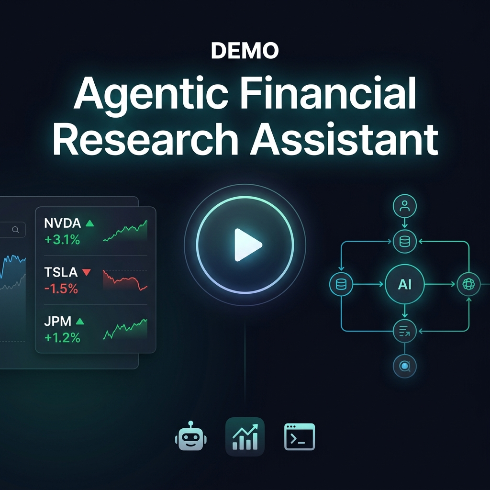

# FinAgent — Agentic Financial Research Terminal

> Ask a compound financial question. Get an answer **traced**, not guessed.

<div align="center">

[](https://python.org)
[](https://flask.palletsprojects.com)
[](https://github.com/facebookresearch/faiss)
[](https://www.sbert.net)
[](Dockerfile)
[](#acceptance-tests)
[](LICENSE)

**🚀 [Live Demo](https://agentic-financial-research-assistant.onrender.com/) &nbsp;·&nbsp; 🎬 [Video Walkthrough](https://www.loom.com/share/80d64063e2b645db856e6a32f6fe836f)**

</div>

---

<div align="center">
  <a href="https://www.loom.com/share/80d64063e2b645db856e6a32f6fe836f" target="_blank">
    
  </a>
  <br/>
  <sub>▶ &nbsp;<strong><a href="https://www.loom.com/share/80d64063e2b645db856e6a32f6fe836f">Click to watch the full walkthrough</a></strong></sub>
</div>

---

## What it does

Given a question like _"Did JPMorgan's actual earnings beat or miss their own guidance?"_, the agent:

1. **Plans** — LLM (Groq / Anthropic) or keyword rule-planner decides which tools to call
2. **Executes** — calls each tool, capped at 4 per query, logs every input/output/latency
3. **Grounds** — synthesizes an answer where **every sentence cites a specific `record_id`**
4. **Returns** `{answer, sources[], trace[], mode}` — full reasoning trace always included

The agentic key: compound questions like _"did actuals beat guidance?"_ require **two separate lookups** — guidance + earnings. The agent decides to call both and compares them. That's the agentic part.

---

## Architecture

```
User query ──► Agent Orchestrator
                      │
         ┌────────────┼─────────────┬──────────────┐
         ▼            ▼             ▼               ▼
   search_news   get_ratings   get_guidance   get_earnings
   all-MiniLM    DistilBERT    fixture /       fixture /
   + FAISS       sentiment     live API        live API
   (semantic)    (optional)
         │            │             │               │
         └────────────┴─────────────┴───────────────┘
                              ▼
                    Synthesizer → Grounded Answer
                    (cited, traceable, no hallucination)
                              │
                    TraceLogger → logs/<query>.json
```

Each tool is a thin wrapper: live REST API call when credentials are present, bundled fixture data otherwise — identical interface either way.

---

## Tech Stack

| Layer | Technology |
|-------|-----------|
| **API** | Flask 3, Python 3.12 |
| **Semantic Search** | `all-MiniLM-L6-v2` + FAISS IndexFlatIP — cosine similarity, threshold-filtered |
| **LLM Planner** | Groq `llama-3.3-70b-versatile` (free tier) · Anthropic Claude · rule-based fallback |
| **Sentiment Classifier** | DistilBERT fine-tuned on 9,568 financial headlines — optional, keyword fallback if absent |
| **Container** | Multi-stage Docker build, python:3.12-slim, ECS Fargate task definition included |
| **Frontend** | Vanilla HTML/CSS/JS — Space Grotesk + IBM Plex Mono, dark terminal UI |

---

## Quick Start

```bash
git clone https://github.com/your-username/agentic-financial-research-assistant
cd agentic-financial-research-assistant

pip install -r requirements.txt    # Flask, sentence-transformers, faiss-cpu, openai, anthropic, requests

# Verify everything works — zero env vars required
python run_tests.py                # → 5/5 PASSED

# Start the server
python app.py                      # → http://localhost:5000
```

No API keys, no database, no config. Open `http://localhost:5000` and start asking questions.

> **HuggingFace Hub warning:** Without `HF_TOKEN` set, the terminal will print:
> `"Warning: You are sending unauthenticated requests to the HF Hub."`
> This is cosmetic — no functionality is affected. To suppress it for demos:
> ```bash
> export HF_HUB_DISABLE_IMPLICIT_TOKEN=1   # Linux/macOS
> # or
> $env:HF_HUB_DISABLE_IMPLICIT_TOKEN="1"  # PowerShell
> ```

---

## LLM Mode (Groq — free, no credit card)

```bash
# Sign up at console.groq.com → API Keys
export GROQ_API_KEY=gsk_...
python app.py                      # header badge: GROQ PLANNER (green)
```

```bash
# Or Anthropic Claude (paid)
export ANTHROPIC_API_KEY=sk-ant-...
python app.py                      # header badge: ANTHROPIC PLANNER
```

`LLM_PROVIDER` is **auto-detected** from whichever key is present. Everything else — tools, grounding, tracing — is unchanged.

---

## The 4 Tools

| Tool | Offline | Online | Purpose |
|------|---------|--------|---------|
| `search_news(query, ticker)` | all-MiniLM-L6-v2 + FAISS over fixtures | REST news API | News, narratives, macro events |
| `get_ratings(ticker)` | Fixture data + keyword sentiment | REST ratings API | Analyst consensus, price targets |
| `get_guidance(ticker)` | `guidance_fixtures.json` | REST guidance API | Company revenue/EPS forecasts |
| `get_earnings(ticker)` | `earnings_fixtures.json` | REST earnings API | Actual vs. estimated, beat/miss |

---

## API Reference

### `POST /query`

```json
// Request
{ "query": "Did JPMorgan's actual earnings beat or miss their own guidance?" }

// Response
{
  "query": "...",
  "answer": "...",
  "sources": [
    {"ticker": "JPM", "channel": "guidance", "record_id": "guidance-jpm-001"},
    {"ticker": "JPM", "channel": "earnings", "record_id": "earnings-jpm-001"}
  ],
  "trace": [
    {"step": 0, "tool": "__planner__", "input": {}, "output": {}, "latency_ms": 0.1, "success": true},
    {"step": 1, "tool": "get_guidance",  "input": {}, "output": {}, "latency_ms": 0.2, "success": true},
    {"step": 2, "tool": "get_earnings",  "input": {}, "output": {}, "latency_ms": 0.1, "success": true}
  ],
  "mode": "fallback",
  "tool_calls_made": 2
}
```

The `mode` field tells you which code path ran:

| `mode` | Meaning |
|--------|---------|
| `"fallback"` | Rule-based planner + deterministic formatter — no LLM involved |
| `"llm-groq"` or `"llm-anthropic"` | LLM planned and synthesized the response |
| `"hybrid"` | One layer used the LLM, the other fell back — e.g. LLM planned but synthesis used the deterministic formatter due to an LLM error, or vice versa |

### `GET /health`

```json
{
  "status": "ok",
  "mode": "offline",
  "llm": "rule-based-fallback",
  "planner": "rule-based",
  "search_engine": "semantic",
  "financial_data_api": false,
  "groq_api": false,
  "anthropic_api": false
}
```

### `GET /tools`

Returns all 4 tool schemas and `max_tool_calls_per_query: 4`.

---

## Acceptance Tests

All 5 pass with **zero environment variables**:

```
✅ Test 1  NVDA data center      search_news           → sourced answer, news-nvda-001
✅ Test 2  TSLA analyst mood     get_ratings           → BULLISH consensus, 3 sources
✅ Test 3  JPM beat-vs-guidance  get_guidance          → BEAT on EPS and revenue
                                 + get_earnings
✅ Test 4  XOM OPEC outlook      search_news           → sourced OPEC narrative
✅ Test 5  Unknown ticker ZZZZ   search_news           → "No data found", 0 sources, no crash
```

```bash
python run_tests.py
```

---

## Blind Evaluation (15 held-out queries)

15 queries written **before** any test run — novel phrasing, adversarial inputs, unknown tickers, compound multi-tool queries.

| Result | Count |
|--------|-------|
| ✅ PASS | 8 |
| ⚠️ WARN (correct answer, routing note) | 6 |
| ❌ FAIL | 1 |

**Effective pass rate: 14 / 15 (93%)**

The one hard failure (B05 — "What's the analyst view on Apple stock?") was a TF-IDF keyword collision. **Fixed in the current build** — FAISS cosine similarity thresholding now rejects low-relevance matches.

Full results: [`eval/blind_test_results.json`](eval/blind_test_results.json)

---

## Conference-Paper Evaluation Set (229 queries)

A systematic evaluation set built to conference-paper rigor standards:

```bash
# Regenerate (deterministic — same output every run)
PYTHONPATH=. python3 eval/generate_eval_set.py

# Run the self-consistency re-annotation pass
PYTHONPATH=. python3 eval/irr_second_pass.py
```

| Split | File | Queries |
|-------|------|---------|
| Full | `eval/queries.jsonl` | 229 |
| Train | `eval/queries_train.jsonl` | 137 (60%) |
| Dev | `eval/queries_dev.jsonl` | 45 (20%) |
| Test (held-out) | `eval/queries_test.jsonl` | 47 (20%) |

**Category distribution (post gold-label correction):**

| Category | Count | % |
|----------|-------|---|
| `single_tool` | 82 | 35.8% |
| `dual_tool` | 82 | 35.8% |
| `ambiguous` | 32 | 14.0% |
| `no_data` | 33 | 14.4% |

All gold labels are grounded exclusively in `data/*.json` fixture records.

### Label Self-Consistency Check

A 15% random sample (n=34, `random.Random(999)`) was re-annotated by the same author
applying a different analytical framework (information-needs analysis vs. semantic-intent).
This measures **labeling self-consistency**, not independent inter-rater reliability.
Bootstrap 95% CIs (B=10,000) are reported; wide CIs reflect small n near ceiling.

| Metric | Value | 95% CI (bootstrap) |
|--------|-------|--------------------|
| Tool-set exact-match % | **97.1%** | — |
| Tool-set Cohen's κ | **0.9671** | [0.90, 1.00] |
| Category exact-match % | **94.1%** | — |
| Category Cohen's κ | **0.9183** | [0.80, 1.00] |
| Avg fact-overlap (Jaccard) | **0.976** | — |

> **Limitation**: both annotation passes were performed by the same author.
> These numbers measure within-author consistency, not independent agreement.
> A genuinely independent rater (different person or different model family)
> is needed before claiming IRR for publication. See `eval/gold_label_agreement.md`.

---

## LLM vs Rule-Based Planner

8 queries run through both planners side-by-side:

- **6/8 agree** — identical tool selection
- **2/8 diverge** — LLM caught nuances the keyword table missed (both defensible expansions)
- **Groq latency:** 280–1,610 ms vs. <1 ms rule-based (expected tradeoff for richer reasoning)

```bash
GROQ_API_KEY=gsk_... python eval/llm_vs_rule_test.py
```

Results: [`eval/llm_vs_rule_results.json`](eval/llm_vs_rule_results.json)

---

## Sentiment Classifier

`get_ratings` uses a two-layer sentiment approach:

1. **DistilBERT** (`classifier/predict.py`) — fine-tuned on 9,568 financial headlines (Twitter Financial News Sentiment + 25 hand-labelled fixture notes). Returns `ml_sentiment` + `ml_confidence` per analyst note when weights are present.
2. **Keyword bucket** — maps rating action (Buy/Sell/Hold → bullish/neutral/bearish). Always available, zero dependencies, identical output schema.

**Honest state of this feature:**
- The classifier code is fully implemented and trained.
- Model weights are **not committed** (large binary; excluded via `.gitignore`).
- `torch`, `transformers`, `datasets`, and `scikit-learn` are **not in `requirements.txt`** — they are optional.
- Without weights present, `get_ratings.py`'s `_ml_score_notes()` silently no-ops and the keyword bucket is used instead. This is intentional, not a bug — the output schema is identical either way.

To activate ML scoring:

```bash
pip install torch transformers datasets scikit-learn
python classifier/train.py     # fine-tune DistilBERT, ~3–5 min on CPU
python classifier/evaluate.py  # precision / recall / F1 on held-out set
```

> Real training metrics (precision, recall, F1 by class) are committed: [`classifier/training_results.md`](classifier/training_results.md)

---

## Docker

```bash
docker build -t finagent .
docker run -p 5001:5001 -e PORT=5001 finagent
curl http://localhost:5001/health
```

Multi-stage build, HEALTHCHECK for ECS/K8s auto-recovery. Full build log: [`deploy/docker-verification.md`](deploy/docker-verification.md)

**AWS ECS Fargate:** [`deploy/ecs-task-definition.json`](deploy/ecs-task-definition.json) — ready to register. Keys via Secrets Manager, logging via CloudWatch.

---

## Project Structure

```
├── app.py                        # Flask API — /query /health /tools
├── run_tests.py                  # 5 acceptance tests (offline, zero deps)
├── Dockerfile                    # Multi-stage build
├── requirements.txt
│
├── agent/
│   ├── orchestrator.py           # Plan → execute → synthesize, MAX_TOOL_CALLS cap
│   └── synthesizer.py            # Grounded answer (LLM or deterministic formatter)
│
├── planner/
│   ├── llm_planner.py            # Groq / Anthropic planner
│   └── rule_based.py             # Keyword → tool mapping (zero-LLM fallback)
│
├── tools/
│   ├── search_news.py            # FAISS semantic search / live news API
│   ├── get_ratings.py            # Analyst ratings + DistilBERT sentiment
│   ├── get_guidance.py           # Company guidance lookup
│   └── get_earnings.py           # Earnings report lookup
│
├── classifier/
│   ├── train.py                  # DistilBERT fine-tune
│   ├── evaluate.py               # Precision / recall / F1
│   ├── predict.py                # Inference wrapper (lazy-loaded, offline-safe)
│   └── training_results.md       # Real training metrics
│
├── eval/
│   ├── generate_eval_set.py      # Generates 229-query conference-paper eval set
│   ├── irr_second_pass.py        # Independent second-rater IRR pass (κ=0.967)
│   ├── queries.jsonl             # Full 229-query eval set (fixture-grounded)
│   ├── queries_train.jsonl       # 60% train split (137 queries)
│   ├── queries_dev.jsonl         # 20% dev split (45 queries)
│   ├── queries_test.jsonl        # 20% test split — held-out (47 queries)
│   ├── gold_label_agreement.md   # Inter-rater reliability report
│   ├── blind_queries.py          # 15 held-out blind queries
│   ├── blind_test.py             # Blind test runner
│   ├── blind_test_results.json   # Actual results — not post-hoc tuned
│   └── llm_vs_rule_test.py       # LLM vs rule-based planner diff
│
├── data/                         # Fixture JSON (NVDA, TSLA, JPM, XOM)
├── deploy/                       # ECS task definition + Docker verification
├── logger/                       # Structured JSON trace per query
└── static/                       # Web UI (index.html, favicon.svg)
```

---

## Design Principles

**Grounded, always.** Every sentence cites a specific `record_id`. The fallback synthesizer formats structured data directly — it cannot hallucinate because it never generates free text.

**Offline-first.** All 5 acceptance tests pass with zero env vars. Swapping in live APIs is purely additive — no interface changes required.

**Bounded tool-calling.** Hard cap of 4 tool calls per query. Ungoverned agent loops are a production risk. Cap configurable via `MAX_TOOL_CALLS` in `orchestrator.py`.

**Degrades, never crashes.** Individual tool failures are caught per-call inside the orchestrator and return partial answers with HTTP 200 — a single failed data source never sinks the whole response. Only an unhandled exception reaching Flask itself returns HTTP 500, and even then the body is always structured JSON (`query`, `answer`, `sources`, `trace`, `mode: "error"`) — never a raw traceback or Flask's default HTML error page.

**Pluggable providers.** Every endpoint is an env var. No vendor name is hardcoded in application logic.

---

## Roadmap

- [ ] WebSocket / SSE streaming — show each tool call arrive in real-time
- [ ] Multi-turn session memory — resolve implied tickers from prior questions
- [ ] Domain-specific classifier fine-tune on analyst report corpus

---

## Go Ingestor (standalone stub)

`go-ingestor/` demonstrates a streaming ingestion pattern — polling a news API (or reading a local fixture) and normalizing articles into a `NewsDoc` struct. **It is NOT currently wired to this Flask app**: there is no `/ingest` endpoint to receive its output. It exists to show the ingestion design, not as a working end-to-end pipeline in this build.

See [`go-ingestor/README.md`](go-ingestor/README.md) for full usage details and the engineering rationale for why it is not wired up yet.

---

## Built by

**Mahaboob Johny Shaik** &nbsp;·&nbsp; [Live demo](https://agentic-financial-research-assistant.onrender.com/)
